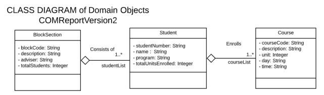
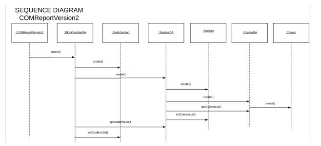
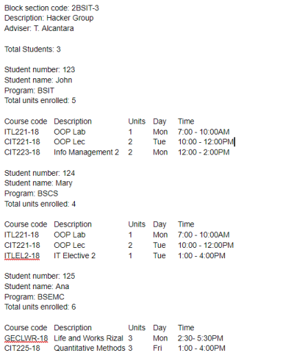

# Lab2_Sample

# Lab2_Trial

Design and create COMReportVersion2 that generates a schedule of students per block
section. You have 3 input files:

blockSection.csv that consists of blockCode, description, adviser name

studentInfo.csv that consists of blockCode, studentNumber, name, program

scheduleInfo.csv that consists of studentNumber, courseCode, description, unit, day, time

Composition of domain objects must be followed:

You may follow the sequence diagram below:

The program MUST HAVE only ONE System.out.println().

Your output may somewhat produce the following report:
